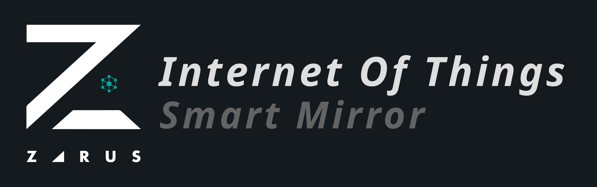
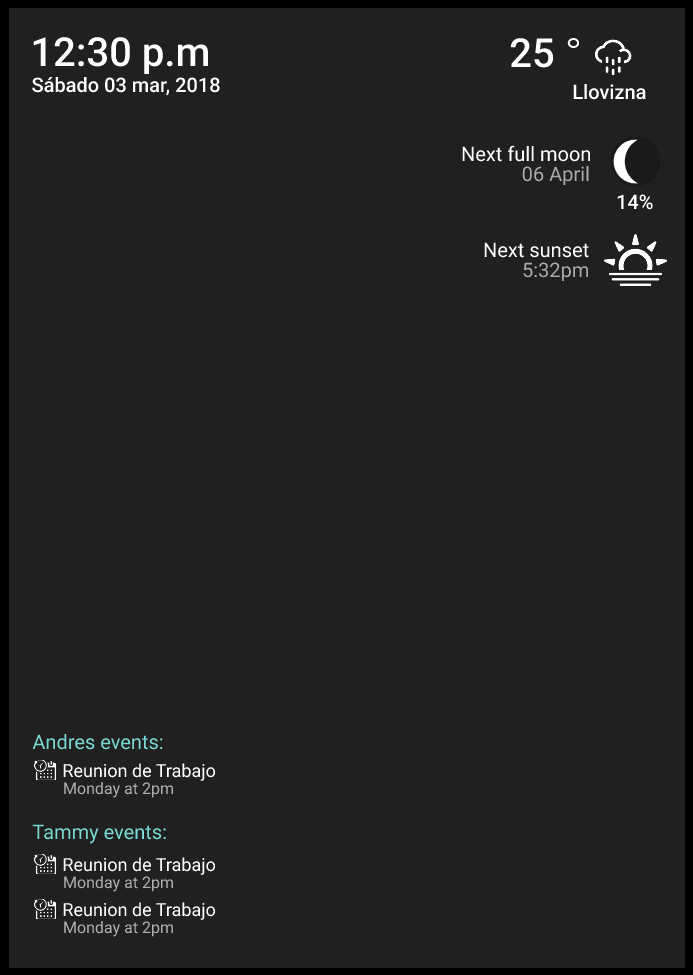

[](https://creativecommons.org/licenses/by-nc-sa/4.0/deed.es)



# Zarus Smart Mirror
A custom version of a Smart Mirror

## Quick Start

### Prerequisites

- Raspberry Pi con Raspberry Pi OS (Debian-based)
- Python 3.9+
- Conexión a internet


### 1. Install system dependencies

```bash
# Tkinter (interfaz gráfica), fuentes y dependencias para OpenCV con soporte de ventanas
sudo apt-get update
sudo apt-get install -y python3-tk python3-venv fonts-roboto libgtk2.0-dev pkg-config
```

### 2. Clone the repository

```bash
git clone https://github.com/<tu-usuario>/smart_mirror.git
cd smart_mirror
```


### 3. Create virtual environment and install dependencies

```bash
python3 -m venv .venv
source .venv/bin/activate
# Asegúrate de NO tener instalada la versión headless de OpenCV:
pip uninstall -y opencv-python-headless
# Instala la versión normal de OpenCV (con soporte de ventanas):
pip install opencv-python
pip install -r requirements.txt
```

### 4. Configure

Copy the configuration template and edit it with your credentials:

```bash
cp configuration_template.json configuration.json
nano configuration.json
```

Fill in:
- **mqtt**: Your MQTT broker address, user, and password
- **homeAssistant**: Your Home Assistant URL and long-lived access token
- **openWeather**: Your coordinates and [OpenWeatherMap API key](https://openweathermap.org/api)

### 5. Run

> **Important:** This is a GUI app (tkinter). It **must** run from a desktop session with a display.
> It will NOT work over SSH unless you forward the display (see below).

#### Option A: Run directly on the Pi's desktop

Open a terminal on the Pi (physically or via VNC) and run:

```bash
cd ~/smart_mirror
source .venv/bin/activate
python3 smartmirror.py
```

#### Option B: Run over SSH (testing only)

```bash
# From the Pi's SSH session, set DISPLAY to the local screen:
export DISPLAY=:0
cd ~/smart_mirror
source .venv/bin/activate
python3 smartmirror.py
```

### 6. Auto-start on boot (recommended)

The mirror should start automatically when the Pi boots into the desktop.

#### Enable auto-login to desktop

```bash
sudo raspi-config
# Navigate to: System Options → Boot / Auto Login → Desktop Autologin
```

#### Install autostart entry

```bash
mkdir -p ~/.config/autostart
cp services/smartmirror.desktop ~/.config/autostart/
# Edit the Exec path in the .desktop file if your install path differs from ~/smart_mirror
```

The mirror will launch fullscreen after the desktop loads on every reboot.

### USB Camera RTSP Stream (optional)

If you have a USB camera connected and want to expose it as an RTSP stream (for Frigate or the Smart Mirror face detection), use **MediaMTX** via Docker.

#### 1. Install Docker

```bash
curl -fsSL https://get.docker.com | sh
sudo usermod -aG docker $USER
newgrp docker

# Verify:
docker run hello-world
docker compose version
```

#### 2. Create the MediaMTX stack

```bash
mkdir -p ~/mediamtx
cd ~/mediamtx
```

Create `docker-compose.yml`:

```yaml
# docker-compose.yml
version: "3.8"
services:
  mediamtx:
    image: bluenviron/mediamtx:latest
    container_name: mediamtx
    restart: unless-stopped
    network_mode: host
    volumes:
      - ./mediamtx.yml:/mediamtx.yml
```

Create `mediamtx.yml`:

```yaml
# mediamtx.yml
rtmp: no

paths:
  live:
    source: publisher
```

#### 3. Start MediaMTX

```bash
cd ~/mediamtx
docker compose up -d

# Verify it started correctly:
docker logs -f mediamtx
```

#### 4. Grant camera access and start the stream

Make sure your user has access to the video device:

```bash
ls -l /dev/video0
sudo usermod -aG video $USER
# Log out and back in (or run: newgrp video)
```

Install ffmpeg if not present:

```bash
sudo apt-get install -y ffmpeg
```

Start publishing the USB camera to MediaMTX:

```bash
ffmpeg -f v4l2 -s 640x480 -i /dev/video0 \
  -c:v h264_v4l2m2m -b:v 2M -r 15 -g 30 -an \
  -f rtsp rtsp://localhost:8554/live
```

The stream will be available at:
- **RTSP:** `rtsp://<PI_IP>:8554/live`

#### 5. Use in Frigate

```yaml
cameras:
  smartmirror_usb:
    ffmpeg:
      inputs:
        - path: rtsp://<PI_IP>:8554/live
          roles:
            - detect
```

#### 6. Use in Smart Mirror (face detection via stream)

```python
FaceDetectorApp(source="rtsp://localhost:8554/live")
```

---

### Helper services (optional)

These systemd services run background scripts for TV control and temperature monitoring:

```bash
# Edit the paths in the .service files to match your install location and username
sudo cp services/checkTv.service /etc/systemd/system/
sudo cp services/tempChecker.service /etc/systemd/system/
sudo systemctl daemon-reload
sudo systemctl enable checkTv.service tempChecker.service
sudo systemctl start checkTv.service tempChecker.service
```

### Auto-start the camera stream (recommended)

To ensure the USB camera RTSP stream is always available after boot, use the provided systemd service:

```bash
# Edit the service file if your user is not 'pi':
nano services/usbcam_stream.service
# (Change User=pi to your username if needed)

sudo cp services/usbcam_stream.service /etc/systemd/system/
sudo systemctl daemon-reload
sudo systemctl enable usbcam_stream.service
sudo systemctl start usbcam_stream.service

# Check status:
sudo systemctl status usbcam_stream.service
```

This will automatically start the ffmpeg stream to MediaMTX on every boot, so the camera is always available for Frigate and the Smart Mirror.

### Python dependencies

| Package | Purpose |
|---------|---------|
| `requests` | HTTP requests (weather, Home Assistant) |
| `paho-mqtt` | MQTT communication |
| `pytz` | Timezone handling |
| `ephem` | Astronomical calculations (moon, sun) |
| `psutil` | System resource monitoring |
| `Pillow` | Image processing (PIL) |
| `opencv-python` | Camera and face detection (con soporte de ventanas) |
| `RPi.GPIO` | Raspberry Pi GPIO pins |


> **Nota importante sobre OpenCV:**
> Si ves errores como "The function is not implemented. Rebuild the library with Windows, GTK+ 2.x or Cocoa support...", asegúrate de:
> - Tener instaladas las dependencias del sistema: `libgtk2.0-dev pkg-config`
> - Usar la versión normal de OpenCV (`opencv-python`), no la versión headless.
> - Desinstalar `opencv-python-headless` si está presente.

> **Note:** `tkinter` is required but is a system package — installed via `python3-tk` in step 1.

### Image Example

[](media/Screenshot_example.png)

----

## Implementations
- [x] Datetime
- [x] Forecast
- [x] Events
- [x] Moon Phase
- [x] Sunset / Sunrise
- [x] Picture Slide
- [x] Face recognition
- [x] Home Assistant Connection
- [x] Mqtt Connection

## License
Zarus Smart Mirror is an open source code. All files are licenced under Creative Commons [Reconocimiento-NoComercial-CompartirIgual 4.0 Internacional](https://creativecommons.org/licenses/by-nc-sa/4.0/deed.es)