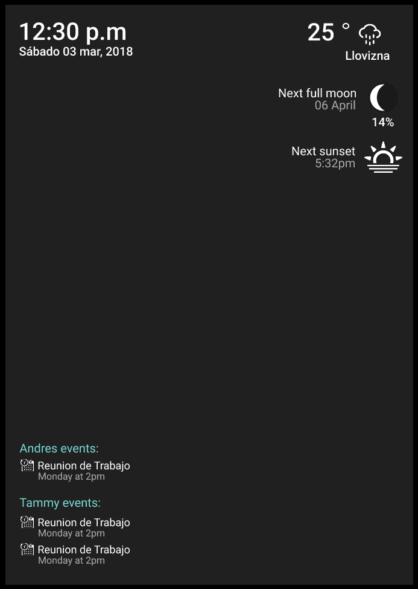

# Zarus Smart Mirror
A custom version of a Smart Mirror

## Quick Start
### Libraries needed

* requests
* paho-mqtt
* pytz
* ephem

### Image Example

----

## Implementations
- [x] Datetime
- [x] Forecast
- [x] Events
- [x] Moon Phase
- [x] Sunset / Sunrise
- [x] Picture Slide
- [x] Face recognition
- [x] Home Assistant Connection
- [x] Mqtt Connection

## License
Zarus Smart Mirror is an open source code. All files are licenced under Creative Commons [Reconocimiento-NoComercial-CompartirIgual 4.0 Internacional](https://creativecommons.org/licenses/by-nc-sa/4.0/deed.es)